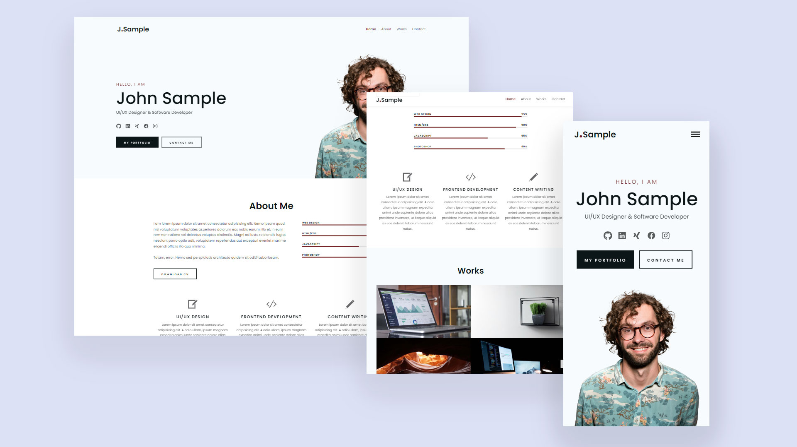

# Simple Developer Portfolio Template



## Description

This is a very simple, but elegant responsive portfolio template built using plain JavaScript, HTML, and CSS. It’s designed to be easily customizable, allowing any developer to quickly create a personal portfolio site. Below you'll find detailed information about the features and how to use this template.

## Table of Contents

- [Features](#features)
- [Live Preview](#live-preview)
- [Usage](#usage)
- [Todo](#todo)
- [License](#license)

## Features

- **Responsive Design**
- **Single-page layout**
- **Simple and customizable**

## Live Preview

Check out the live preview of the Simple Developer Portfolio [here](https://hhlitval.github.io/simple-portfolio-template).

## Usage

To use this template, follow these steps:

1. **Clone the Repository**: 
    ```bash
    git clone https://github.com/hhlitval/simple-portfolio-template.git
    ```
2. **Customize the Content**
3. **Deploy**.

## Todo

- **Contact Form**: Implement the functionality to send messages from the contact form. You can use an email service or integrate with a backend solution.

## License

This project is licensed under the MIT License.
